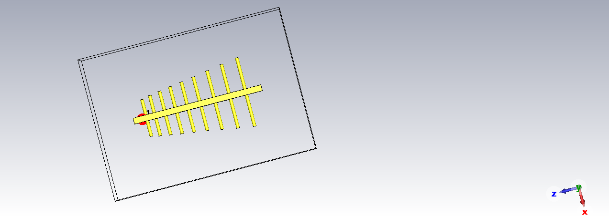
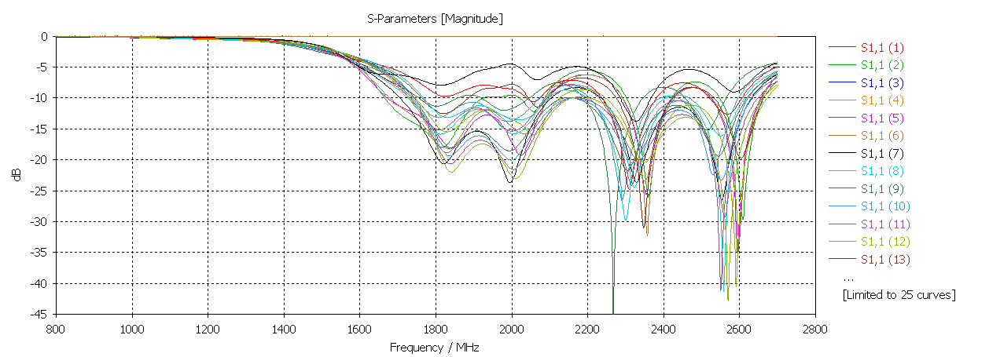
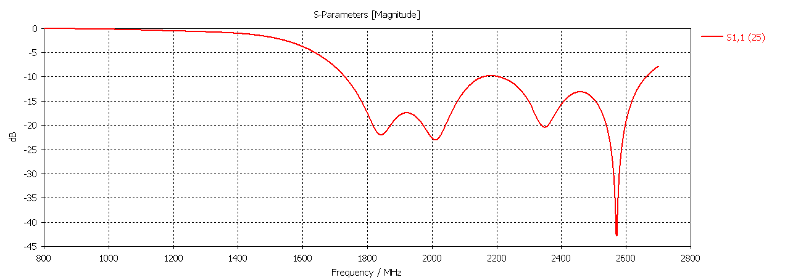
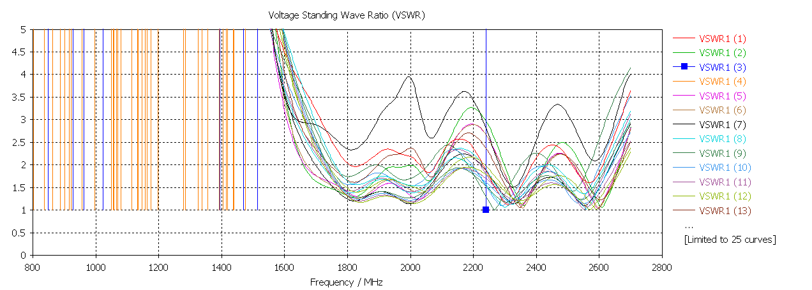
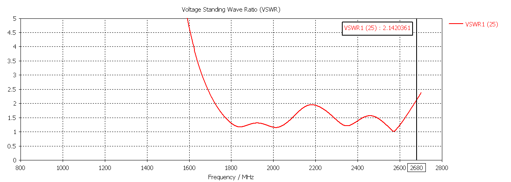
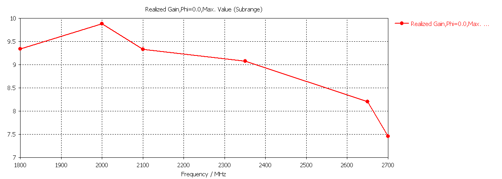

## Log - Perdiodic dipole array - antenna do odbioru sieci LTE 
# Obsługiwane częstotliwości 
LTE 1800 MHz (UL: 1710 - 1785[MHZ], DL: 1805 - 1880 [MHz]) 
LTE 2100 MHz (UL: 1920 - 1980[MHz], DL: 2110 - 2170[MHz]) 
LTE 2600 MHz (UL: 2500 - 2570[MHz], DL: 2620 - 2680[MHz]) 

# Model 
Antena składa się z 9 dipoli na każdą ze stron.  
 

<!-- @TODO FARFIELDY DLA KAZDEJ F  -->

# S11
Return Loss  
Wyniki wszystkich symulacji 
 

Wyniki symulacji z najlepszym rezultatem 
 

Wyniki są zadowalające - antena nadaje się do odbioru 

# WFS
Współczynnik fali stojącej 
Wyniki wszystkich symulacji  
 

Wyniki symulacji z najlepszym rezultatem 
 

# Zysk energetyczny 
Rzeczywisty zysk energetyczny 

